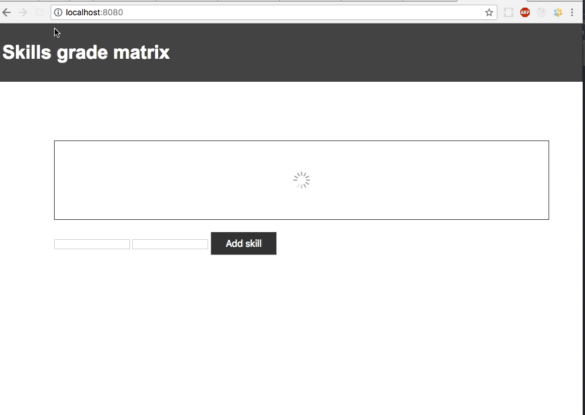

## Simple app about my professional skills

### Using 
- node.js
- express
- mysql

## Getting Started

1. install node.js
2. install mysql
3. create "andrei" db
4. open the project and write in the terminal: `node inde.js`
